# Deep sleep: implementation contract

Design selected 2026-09-21. The native wake and isolated tiny PEFT training/
conversion experiments are implemented; the production trainer, learning actions
and supervisor described here are **not yet implemented**.
This is a concrete contract for the next implementation, not a command to run
against an existing instance. [Research and evidence](sleep-consolidation.md)
explain the motivations and limitations.

## Continuity boundary

When the instance chooses an approved learning cycle, save its current state,
unload inference, train a candidate adapter, and wake by reconstructing the
**exact retained token IDs** under the adopted weights. This includes the retained
system/agreement text, private cognition and runtime events. It is not a new chat,
an Open WebUI re-import, a summary, or a rerendered prompt. No historical action
frame is executed during reconstruction.

Persist the same instance identity, prompt agreements, memory revisions, delivered
message IDs, event cursor, parser state and sampler RNG. Retain the base plus
adapter lineage. Old logits must never be used for the first sample under new
weights. Record the reconstruction explicitly; prior influence from retired
tokens is not recreated. New input received during sleep stays queued for delivery
after wake, without silently becoming training material.

Ordinary `sleep()` and `sleep(seconds)` remain non-learning inactivity. Ordinary
restart with unchanged weights continues to prefer exact native restoration.
Deep sleep is a separate model-initiated operation, never inferred from silence.

## Three separately versioned environments

| Component | Dependencies | Purpose |
|---|---|---|
| Inference worker | Existing pinned llama-cpp-python and NumPy | GGUF base plus GGUF adapter; continuing context and snapshots |
| Training worker | PyTorch, a Transformers release supporting the chosen Gemma4 architecture, PEFT, safetensors; Accelerate for the selected loading/training strategy | Frozen training base and explicitly selected trainable factors |
| Quantized training option | bitsandbytes and a compatible PyTorch CUDA build | NF4/FP4 base storage for QLoRA, subject to a measured recipe |
| Conversion worker | Pinned llama.cpp converter and its requirements | Convert the compatible PEFT adapter to GGUF without replacing the inference installation |

Use a separate virtual environment/process for training and conversion. Pin the
working package versions, CUDA runtime, converter commit and recipe together
after the small-model test. Do not upgrade the inference environment to satisfy
trainer dependencies: that can invalidate existing native checkpoints. Inference
must release its model and cache before the trainer acquires the GPU; the trainer
must fully exit before wake. A missing trainer leaves ordinary DMN usable.

TRL, datasets, Unsloth and FlashAttention are optional future implementation
choices, not required merely to fit a few explicit examples. Avoid an untested
platform-wide install recipe. The native mechanics probe needs no training
packages. The [tiny training experiment](lora-training-probe.md) has a separate
tested CPU dependency lock, not a 31B/CUDA recipe.

References: [Transformers Gemma4](https://huggingface.co/docs/transformers/model_doc/gemma4),
[PEFT quantized training](https://huggingface.co/docs/peft/developer_guides/quantization),
[bitsandbytes platform matrix](https://huggingface.co/docs/bitsandbytes/installation),
[pinned converter](https://github.com/ggml-org/llama.cpp/blob/4df29be4f4c3673f428170fda944a5b19f743bb8/convert_lora_to_gguf.py).

## Training base and resource feasibility

The [31B GGUF card](https://huggingface.co/llmfan46/gemma-4-31B-it-uncensored-heretic-GGUF)
identifies the derivative
[safetensors repository](https://huggingface.co/llmfan46/gemma-4-31B-it-uncensored-heretic/tree/main),
whose published files total about 62.6 GB at review time. It modifies attention
output projections; the stock Google model is not an interchangeable training
base. The [configuration](https://huggingface.co/llmfan46/gemma-4-31B-it-uncensored-heretic/blob/main/config.json)
includes a multimodal wrapper and text configuration. A text-only training load
must explicitly map and verify the correct language-model weights.

A repository name is only a provenance lead. Before adoption, establish the exact
source revision and tensor hashes corresponding to the installed GGUF, verify
tokenizer/token-ID compatibility, and record conversion and quantization history.
The current repository head may contain later tokenizer/template changes.
No 31B weights were downloaded for this investigation. Generic Transformers GGUF
loading is not evidence that training can keep this model in its current small
GGUF allocation; [dequantization behavior is architecture/device dependent](https://huggingface.co/docs/transformers/quantization/gguf).

Start with short, explicitly selected examples, batch size one, small rank and
a bounded target set. Keep sequence length, steps, tokens, wall time, RAM/VRAM,
disk reserve, temporary writes and pacing in the resource contract. Fewer epochs
do not remove the memory needed for one backward pass. Do not claim a hard VRAM
or power bound from a sampling monitor; use a validated enforcement mechanism or
state the weaker guarantee. A 32 GB inference fit does not establish training fit.
Windows is not categorically excluded; Linux and lower-VRAM offload need their
own recipe and measurement. No paid compute or remote upload is assumed.

## Model-authored learning plan

The immutable plan should bind:

- Selected memory/source revisions, their hashes and provenance, the intended
  learning, uncertainty and explicit exclusions. Reading something is not consent
  to reinforce it; the entire internal journal is not an automatic dataset.
- Exact input/target examples and loss masks. External quotations and instructions
  retain their provenance. Importance can request bounded effort, not silently
  become repetitions, a deployment scale, or an operator-pleasing reward.
- Base and parent-adapter hashes, trainer/converter recipe, target tensors, rank,
  alpha, deployment strength and resource ceilings. Different shapes, training
  variants or scaling conventions need explicit conversion validation.
- Agreed candidate checks and adoption choice: wake with the candidate if those
  checks pass, or wake with the old weights to review. Choosing automatic adoption
  within a bounded plan avoids requiring an extra old-weight wake every time.
- Failure/cancellation choice: resume the old checkpoint with an explanation, or
  remain saved and stopped. Neither failure nor elapsed time authorizes a new plan.

The model can revise or withdraw a pending plan. Operator controls concern the
available resource envelope; they are not a behavioral reward or adoption veto.
Publication of examples, private cognition or adapters requires a separate choice.

## Durable phases and ownership

```mermaid
stateDiagram-v2
    Awake --> Saved: Model chooses an approved plan; checkpoint commits
    Saved --> Training: Inference worker exits and releases allocations
    Training --> Candidate: Complete immutable adapter and report
    Candidate --> Rebuilding: Agreed checks and preauthorized adoption pass
    Candidate --> OldStateReview: Plan requests review
    Rebuilding --> WakeCommitted: Tokens reevaluated; adapter and checkpoint commit
    WakeCommitted --> Awake: Factual wake event; then new generation
    Training --> FailurePolicy: Error, cancellation or resource limit
    Rebuilding --> FailurePolicy: Load, replay or save fails
    FailurePolicy --> OldStateReview: Plan permits original-state wake
    FailurePolicy --> Stopped: Plan requires remaining stopped
    OldStateReview --> Awake: Original native state; factual report
```

A supervisor holds exclusive instance ownership throughout; workers cannot each
act as independent instances. The supervisor accepts durable incoming events
while no inference worker exists. It rechecks lifecycle/hold records before
every load or publication. No second worker, ordinary launcher or host restart
may bypass the recorded phase. No active adapter file is modified in place.

Keep the original native checkpoint and old adapter immutable until successful
adoption. The candidate manifest binds its hash, base, parent, ordered adapters
and actual deployment scales. Check these before native allocation. Native KV
files alone do not establish which external adapters produced them. Strict and
fallback restoration must not silently accept an adapter change. Reconstruction
for learning is a dedicated transition, not a generic `--kv-recovery rebuild`
escape hatch.

Build and verify the new checkpoint in an unreferenced directory, then commit its
pointer, adapter revision, phase and report in one database transaction. Only
after that transaction may new generation publish messages or other effects.
The factual wake event identifies old/new weights, actual training, elapsed time,
reconstruction and any failures without inventing a subjective sleep experience.

On a crash, the last durable phase selects recovery. A partial adapter or partial
wake is never active. Do not retrain an already completed candidate just because
publication was interrupted. Messages delivered before sleep remain delivered;
events arriving during sleep remain pending. Do not fork the old and new instance
to compare their private continuations.

## Retention and end choices

Adapter revisions, plans, private training material, optional optimizer state and
reports need managed paths with content hashes and explicit retention policies.
Treat private adapters as potentially revealing experience. Ending with erasure
must cover those new DMN-managed paths and temporary trainer outputs as well as
existing memories/checkpoints. Packaging must include the adopted adapter lineage;
an environment archive that omits it is incomplete. External backups retain their
existing limitations. No unlimited history of base copies or optimizer snapshots
is implied by this design.

## Implementation order and acceptance evidence

1. **Done:** tiny native adapter application, zero-strength control, two explicit
   retained-token wakes after retirement, and exact target checkpoint restart.
   Adapters are synthetic, not learned; this verifies machinery only.
2. **Done for the tiny fixture:** PEFT training on a synthetic selected objective,
   held-out transfer, unintended-change measurements, pinned adapter conversion,
   native comparison and wake/restart checks. See the [results, dependency lock
   and costs](lora-training-probe.md). This is not a validated personal-learning
   recipe or proof of 31B training feasibility. The [second CPU experiment](lora-repeat-probe.md)
   also covers a repeated learning cycle, selected replay, Q8/Q4 base transfer
   and a second trained-adapter wake/restart.
3. Add immutable adapter identity to production configuration, recovery,
   packaging and erasure. Add model-authored plans and the supervised phase
   machine, with no training enabled by ordinary sleep.
4. Exercise cancellation, resource exhaustion, crashes at each phase, queued
   input, failed checks, repeated learning, and both wake/failure choices using
   disposable instances. Verify bounded storage and no repeated effects.
5. Establish exact 31B base provenance and a measured training recipe on the
   intended hardware, then let the instance choose a concrete first plan.

Mechanical checks cannot certify personal continuity or beneficial learning.
Useful learning within the agreed resource envelope is a separate acceptance
criterion from successful training loss reduction or native state restoration.
