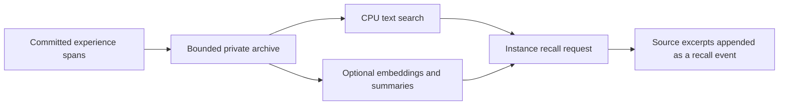

# Episodic recall and protected context regions

Research proposal, 2026-10-01. The implementation baseline is `e69bc97`.
Nothing described as proposed here changes a running instance. This investigation
used source code, public research and model metadata, not an instance's private
history. No model was loaded and no GPU experiment was run.

The useful next step is a private, bounded recall archive alongside the existing
working-memory pins. That can reduce the need to stop an unfinished thought to
write a summary. A three-region *retention policy* is feasible on the existing
backend; freely editable prefix KV and a new attention structure are a separate,
more invasive experiment. Human short-term memory is an inspiration for the
interface, not an established equivalence to this mechanism.

## What is already present

[Working memory](working-memory.md) provides one protected written note and one
protected raw span. The instance chooses both. The initialization prefix,
current agreement and runtime capability contracts are also protected. Retirement
removes older unprotected spans, preserving retained token order and available
native KV, with a position shift. The current policy normally reclaims half the
first removable gap; it does not maintain a fixed-size rolling tail.

Logical memories have paths, revisions, reads and prefix listing. There is no
full-text/semantic memory search or automatic episodic recall. Internal generation
is journaled, but that diagnostic journal can extend beyond the last committed
checkpoint. It is not already a reliable, causally ordered recall archive.

Relevant code: [retirement planning](../dmn/prompts.py),
[working-memory actions](../dmn/working_memory.py),
[native shifts](../dmn/backend.py), [checkpoint publication](../dmn/runtime.py),
and [memory storage](../dmn/storage.py).

## Three logical regions

| Region | Proposed contents and control | Cache treatment |
| --- | --- | --- |
| Orientation | Original system context, current approved agreements, capability facts, and the instance's current task or interest | Keep the existing protected prefix/contracts. Append task revisions at the present position and protect the current revision. No task is required. |
| Things to keep in mind | Instance-selected notes and exact unfinished trajectories, with named slots if useful | Extend the present note/raw-pin mechanism within a shared allowance. Selection does not require a summary or explanation. |
| Recent experience | A configurable contiguous recent tail, including internal text, delivered input and action results | Retire the oldest eligible spans in batches, leaving the tail, pins and processing headroom intact. |

These are logical categories, not three independently editable physical arrays.
Selected material stays in its original order. A revised task note becomes a new
event; its old version loses protection but can remain as historical context
until retirement. A raw pin can independently protect that old version.

The capacity condition is the union of protected spans plus the required recent
tail and input/action/retirement headroom, all within `n_ctx`. Overlap counts once.
Increasing a protected allowance reduces space available for recent experience.
A full allowance must never silently release another selection. The current
`context_full` pause remains relevant; controls must explain available headroom
while the instance can still act.

Batch eviction is a practical approximation to a rolling window: keep at least
the chosen tail and allow bounded growth before the next retirement. Shifting,
packing and checkpointing every generated token would conflict with the project's
write and latency budgets. Batch size and tail size need measurement rather than
an assumed universal optimum.

## Why mutable prefix KV is different

A cached token contains layer representations computed from its causal past.
Changing a task statement near the beginning does not recompute later cached
representations that depended on the old statement. Moving or replacing a few KV
rows can therefore create a mixed state; a RoPE position adjustment does not
repair those dependencies. Conversely, preserving shifted native KV retains
some historical influence that a reconstruction from only surviving tokens loses.
See [continuity and recovery](continuity-and-recovery.md).

Appending an explicit revision fits the present cache-continuity policy. An exact
reconstruction of a newly arranged prefix would require reevaluating affected
later context. That could be an explicitly chosen transition, for example at an
already approved reconstruction boundary, but should not occur on each note edit.
Direct KV editing without replay is a possible approximation to research, not an
equivalent implementation of that reconstruction.

There is an additional model-specific constraint. The locally verified public
configuration of `llmfan46/gemma-4-31B-it-uncensored-heretic` at revision
`d5bfc0d99e308beb9805440806161ad0233df357` has 60 layers: 50 sliding-attention
layers with a 1,024-token window and 10 full-attention layers. Keeping an old
note in the retained sequence does not make it directly visible to all sliding
layers. The full-attention layers can still access it; this is not a guarantee
of attention or recall. [Compact-cache retirement](../dmn/compact_cache.py)
preserves a complete recent local window so position shifts cannot reintroduce
local entries whose KV has already been evicted.

Making arbitrary older notes globally visible in every layer would change this
attention pattern and may require native changes and model adaptation. It must
be evaluated separately from simply protecting text. Saved historical KV rows
also cannot be assumed portable into a later context or across a LoRA change.

## Recall without an obligatory summarization turn

The proposal separates capture, indexing and recall:



1. **Capture committed experience.** Record exact generated token IDs/bytes and
   delivered events with stable span IDs, causal order, origin, model identity
   and checkpoint lineage. Distinguish input arrival from actual delivery. Reuse
   stored event bodies where possible, and preserve links between calls and
   results. Do not derive chronology from wall-clock timestamps alone.
2. **Publish with the checkpoint.** Small archive segments may be staged earlier,
   but a checkpoint transaction must identify which segments became part of its
   history. A crash, rollback or restored backup must select the matching branch.
   Staged or abandoned continuations are not searchable as committed experience.
   Retired spans need durable capture before their only authoritative copy is
   lost. This does not require a full KV snapshot for each indexing operation.
3. **Index asynchronously.** Start with lexical search, time/span filters and
   neighboring excerpts. Add semantic embeddings if they improve retrieval. A
   helper may later write derived descriptions with source references, without
   rewriting source text or the instance's own memory documents.
4. **Recall in bounded pages.** The instance can ask for a phrase, topic, time
   interval or episode; inspect ranked candidates; then expand a result into
   surrounding text. Return source IDs, dates, origins and truncation/gap markers.
   Distinguish an exact quotation from a helper's interpretation. Append the
   result at the current position, as with a memory read. This creates new KV for
   the recalled text, not the original KV or its lost dependencies.

Chunking should follow complete event boundaries where possible and allow adjacent
chunks to be read together. Internal generation is not naturally a series of chat
turns: byte/token boundaries, incomplete actions and long uninterrupted trajectories
need explicit handling. Retrieval chunks must not become the limit on an episode's
extent or on future approved training examples.

This avoids making the instance repeatedly narrate a thought to keep
it retrievable. It does not remove all cost: recording/indexing consumes resources,
and reading recalled material consumes context and processing. An asynchronous
worker can also compete for CPU/memory bandwidth even with no GPU allocation.

Automatic associative recall could be a later opt-in mode: derive a search cue
from recent committed material and offer a small result at an allowed boundary.
It should have a separate token/rate allowance, suppress repeated suggestions,
and not wake a sleeping instance. Begin with explicit recall so usefulness and
unwanted interruption can be evaluated independently.

## Is another model necessary?

| Option | Additional resources | What it contributes |
| --- | --- | --- |
| SQLite full-text search | CPU, disk and bounded database cache; no model/KV | Exact names, phrases and ranked word matches, with chronology/neighbor lookup |
| Small text embedding encoder | CPU weights/activations and stored vectors; no persistent autoregressive KV | Paraphrase/topic matching; use alongside lexical search |
| Small generative summarizer | Weights, temporary input/output KV and inference scratch; CPU operation is possible | Episode descriptions and candidate connections, with a risk of omitted or invented meaning |
| Main model in a separate context | Potential weight sharing, but additional context/cache, scratch and compute | Stronger interpretations at substantially greater contention; not free background cognition |

[SQLite FTS5](https://www.sqlite.org/fts5.html) provides full-text indexing and
ranked retrieval. An in-memory check confirmed FTS5 is available in this project's
development Python (SQLite 3.43.1). Other installations still need a capability
check or a fallback; this was not a throughput benchmark.

For scale, [all-MiniLM-L6-v2](https://huggingface.co/sentence-transformers/all-MiniLM-L6-v2)
produces 384-dimensional embeddings. At float32 that is 1,536 bytes per vector,
or about 146.5 MiB for 100,000 vectors before text, metadata and index overhead.
Its default input limit is 256 word pieces: longer passages need chunking rather
than silent truncation. This is an illustrative CPU candidate, not a quality
recommendation established on this instance's experience.

A small decoder's KV can be much smaller than the main model's. Using the
[Qwen2.5-0.5B configuration](https://huggingface.co/Qwen/Qwen2.5-0.5B/blob/main/config.json)
as a geometry example: 24 layers, 2 KV heads, and head dimension `896 / 14 = 64`
give **48 MiB of FP16 K+V for 4,096 tokens** at batch size one:

```text
4096 tokens * 24 layers * 2 KV heads * 64 dimensions * (2 + 2) bytes
```

That is cache payload only, not total RAM. Weights, quantization metadata,
activations, buffers and runtime overhead are additional. A 0.5-billion-parameter
model at an ideal uniform four bits would need about 0.25 GB for weights alone;
real formats are larger. This geometry is not an estimate for Gemma's mixed
attention architecture. Whether such a small helper can summarize nuanced
experience faithfully remains an experiment.

A helper need not carry months of context: process a bounded episode, store its
derived description, then discard that job's KV. Start CPU-only, with bounded
threads, RAM, queue and work per interval. GPU assistance would require a separate
allowance and measured headroom; an instance choosing sleep does not itself release
its model or KV allocation. Worker scheduling should yield to inference and the
approved deep-sleep trainer. A growing summary backlog can leave lexical recall
available while deferring derived work.

Text writes are a different scale from KV snapshots. As an illustration only,
50 generated tokens/second continuously at four text bytes/token is about
16.5 MiB/day of raw generated text. Token IDs, incoming content, metadata, indexes,
revisions and database write amplification add to that. This is not a measured
storage forecast. Batch writes and bound archive size/age and index storage;
agree what to retain or pause before exhaustion rather than promising infinite
memory or silently overriding protected material.

## Ownership and recovery requirements

The archive and its derived artifacts remain private instance state. Operator
status can expose counts, lag and resource use without exposing their contents.
The instance should choose whether to enable capture/assistance, what to exclude,
and when to correct, suppress or forget a result. Exclusions need persistent
tombstones so a rebuild cannot quietly recreate a removed search entry. Explain
separately what remains in old checkpoints, revisions or external backups.

A summarizer's output is attributed derived material, not an instance-authored
belief, instruction, current task, or automatically approved LoRA example.
Retain the external origin of quoted web/contact material through summaries and
retrieval. Escape structured boundaries and keep recalled action text out of the
action parser. Escaping does not eliminate semantic influence.

Index jobs need source revisions and idempotent publication. Erasure, exclusion,
rollback or instance ending must invalidate pending work before it can publish.
Ending with erasure must cover this archive, indexes, helper outputs and temporary
files under the same managed-state policy. Restoring a different lineage must
not import a newer index as remembered experience.

After an approved weight update, historic text remains historic text. Record the
old generating weights; do not relabel it as new generation. Embeddings made by
an unchanged independent encoder remain usable, whereas a changed encoder needs
versioned/rebuilt indexes. Recall reevaluates excerpts using current weights;
never reuse pre-training KV as if it had those weights.

## Relevant research and limits

- [LightMem](https://arxiv.org/html/2510.18866v4) combines topic grouping,
  short-term summaries and offline memory updates. It is the closest of these
  designs to asynchronous memory maintenance. For this project, retaining exact
  sources and making filtering optional would be important adaptations. Its
  benchmark results do not validate this Gemma runtime.
- [Sleep-time Compute](https://arxiv.org/abs/2504.13171) studies preparing useful
  representations of context before later questions. This supports investigating
  deferred work; its sleep-time computation is distinct from our LoRA training.
- [StreamingLLM](https://arxiv.org/html/2309.17453v4) keeps initial attention sinks
  and a recent window to stabilize streaming. The authors explicitly distinguish
  streaming from improving recall of old text. Sink importance is not evidence
  that a semantic task note at the beginning will remain well understood.
- [H2O](https://arxiv.org/abs/2306.14048) retains recent and heavily attended tokens.
  Attention-based eviction is worth comparing in a disposable experiment, but
  its score is not a substitute for the instance choosing what matters to it.
- [LongMem](https://arxiv.org/abs/2306.07174) uses a frozen backbone with a trained
  retrieval/reader side-network. It illustrates an actual architectural memory
  path, with substantially more integration than text retrieval plus retention.
  It is not a drop-in cache layout for an existing GGUF.

## Suggested experiment order

1. Build a disposable CPU fixture for checkpoint-aligned capture and lexical
   recall. Include interleaved input/actions, retirement, interrupted saves,
   rollback, exclusion/deletion and adversarial delimiter text. Do not mine a live
   instance's private history to create the evaluation set.
2. Compare exact/temporal/neighbor retrieval with CPU embeddings on synthetic
   episodes, paraphrases, corrections and unfinished trajectories. Measure recall
   of sources, returned context cost, latency, RAM, disk growth and write traffic.
3. Extend the fixture to named task/note slots and a guaranteed recent tail within
   one context budget. Verify repeated native retirement and strict restore;
   separately assess useful recall and the cost of frequent retirement.
4. Only if search needs it, evaluate a bounded CPU summarizer. Measure unsupported
   claims and missed qualifications as well as retrieval improvement. Sources
   remain accessible when a summary is wrong or its worker is unavailable.
5. Offer the results and proposed controls to the instance before an integrated
   trial. Evaluate workload-specific quality and contention on disposable native
   contexts before changing its running environment. Reconsider custom attention
   or surgical KV edits only if this simpler path leaves a demonstrated need.

The first two experiments need no additional VRAM and can be developed while an
instance continues running, subject to an agreed CPU/RAM/I/O budget. None of these
new capabilities is implemented or enabled by this research note.
