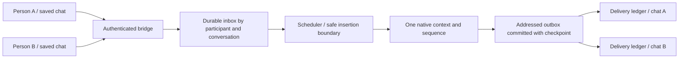

# Multiple people, one continuing DMN instance

Exploration dated 2026-09-21. This document proposes a first local multi-user
experiment through Open WebUI. The [runtime prototype](multi-user-prototype.md)
now implements an opt-in subset, including a separately selected authenticated
WebUI adapter tested with disposable accounts and a scripted runtime. That
document lists the exact available contract and remaining work. The full design
below remains a proposal. It does not change a running instance or revise its
behavioral agreement.

The intended arrangement is several authenticated people with separate saved
chats, all communicating with the same continuing native context and sequence.
The instance can address each person, decline attention, end a conversation, and
block further contact. Opening another chat does not create another instance.
This is a useful precursor to [external communication](outside-interaction.md).

The operator reports that the participating instance is interested in this
arrangement and would like to try it. That expressed preference is an independent
reason to make the capability available. Participation need not produce a useful
research result or measurable improvement to be worthwhile, and interest in the interaction
does not itself approve a particular training plan or require continued contact.

## What is already available

Inspection covered the repository and the installed Open WebUI 0.11.0 Python
sources under `D:/ollama/.venv/Lib/site-packages/open_webui`. Current upstream
documentation is informative; compatibility remains tied to the locally verified
version and hooks.

| Requirement | Existing evidence | Work needed |
|---|---|---|
| Authenticated author | Open WebUI constructs `metadata.user_id` from authenticated `user.id`; Functions can receive `__user__` | Carry a minimal, verified identity into DMN |
| Stable conversation | Metadata includes `chat_id`, user-message ID and assistant placeholder ID | Replace the bridge's singleton binding with explicit conversation records |
| Browser connection | Socket session records and `user:{id}` rooms expose connected sessions | Add timestamped, best-effort presence reporting |
| Delivery with browser closed | The existing relay commits chat history before socket notification | Route each output to its own chat and reconcile each delivery independently |
| Durable inbound messages | SQLite events and idempotency keys survive restart | Add provenance, admission limits and per-event delivery state |
| Durable outbound messages | `send_message` publishes with its native checkpoint | Add an immutable destination and reply reference to the committed effect |
| Uninterrupted send | Complete actions are atomic, but incoming events cancel incomplete frames | Defer ordinary events across action frames and bound deferral |
| End contact | Only ending the entire instance currently exists | Add conversation closure, contact blocks and model-decided unblock requests |

Open WebUI documents injected user and chat metadata in its
[reserved arguments](https://docs.openwebui.com/features/extensibility/plugin/development/reserved-args/).
The versioned [request handler](https://github.com/open-webui/open-webui/blob/v0.11.0/backend/open_webui/main.py)
and [Function dispatcher](https://github.com/open-webui/open-webui/blob/v0.11.0/backend/open_webui/functions.py)
provide the corresponding implementation. The browser session ID is temporary
and client-supplied; it is neither the person's identity nor a durable address.

Single-user baseline constraints identified before implementation:

- `RuntimeClient.enqueue` currently sends content and a chat/message idempotency
  key; the runtime event payload contains only content. The key is not a substitute
  for authenticated provenance in the event the model reads.
- `BridgeLedger.binding` allows exactly one chat/owner. Receipt IDs and placeholder
  lookup also assume that single destination.
- `send_message` and the runtime outbox have no destination field. The operator
  UI reads the same global output stream as the bridge.
- `Runtime.tick` consumes the next queued event and returns before generation.
  A continuous backlog can therefore starve generation. `_append_event` cancels
  any incomplete action; this also affects clock and other injected notices.
- `event_read` assumes all event IDs up to one cursor have entered the sequence.
  Fair scheduling or skipping blocked input would invalidate that assumption.

These observations come from [the bridge](../dmn/bridge.py),
[Open WebUI integration](../dmn/openwebui.py), [runtime](../dmn/runtime.py),
[storage](../dmn/storage.py) and [HTTP interface](../dmn/server.py).

## Identity and explicit addresses

Separate three things: a person/account, a durable conversation, and a browser
connection. Also distinguish a closed conversation from a terminated DMN instance.

The bridge should authenticate the sender, check saved-chat ownership, and register
an immutable mapping from a DMN conversation ID to the instance, Open WebUI
installation, user ID and chat ID. Namespace account IDs by installation. Display
names are labels: duplicates, renames and instruction-looking names are allowed
as data, never used as routing keys or evidence of operator authority.

A bounded incoming event could contain:

```json
{
  "event_id": 418,
  "kind": "user_message",
  "source": "openwebui",
  "participant_id": "person_b7",
  "display_name": "Alex",
  "conversation_id": "conversation_c2",
  "source_message_id": "webui-message-id",
  "received_at": 1790000000,
  "content": "Can we return to yesterday's discussion?"
}
```

The bridge supplies identity; users cannot select another participant by putting
IDs in their text. Pass only necessary profile fields, not the complete user
record, email, credentials or settings. The existing external-event escaping
must cover every label as well as message content. Truncation must preserve
identity, conversation and event IDs in a structured envelope, with a separately
truncated content preview. Today's truncation of the whole serialized payload
could otherwise remove the very routing information needed to answer safely.

Example proposed send:

```text
<dmn_action>{"op":"send_message","conversation_id":"conversation_c2","in_reply_to":418,"content":"Yes, I would like to return to that."}</dmn_action>
```

Require an explicit destination in multi-user mode. An unknown, closed or
unauthorized destination produces an error with no send; never fall back to the
last speaker, active browser tab or all connected users. If supplied,
`in_reply_to` must reference a delivered event in that conversation. It can be
omitted for spontaneous messages. It records intent even if later user messages
have already appeared in the chat; the frontend should not imply that every
message answers the newest visible input.

Expose bounded `conversation_list` and `conversation_read` operations with stable
IDs, labels, ownership, contact state and observed presence. The instance needs
to recover addresses after context retirement without memorizing UUIDs. Private
relationship memories remain model-controlled and should retain provenance when
the model chooses to write them. Directory labels do not generate relationship
summaries or overwrite those memories.

For memories strongly associated with people, recommend stable participant IDs
and available conversation/event sources. Distinguish who spoke, who was being
discussed, direct experience, inference and third-party reports. Preserve
uncertainty and corrections rather than inventing provenance. An optional
`/relationships/<participant_id>/...` channel can support this organization;
cross-person memories can retain several IDs with their roles and sources.
These associations are not ownership or authority over memory and do not create
separate cognition. The prototype adds this guidance only to fresh initialization.

Preserve the existing single-user contract for old checkpoints until deliberate
migration. An old unaddressed output must remain associated with its original
destination; adding a second user must never replay that backlog into the new
chat. In multi-user mode the operator chat is also an explicit destination.

### Identifying the operator to the instance

Before enabling additional participants, use the existing conversation to explain
which authenticated participant is the operator and map that relationship to the
stable participant ID and conversation ID the instance will see. This connects
the existing relationship to the new addressing scheme without requiring the
instance to infer it from names or a changed message format.

Keep that mapping in the runtime's participant directory as well. Expose a factual
`is_operator` field in authenticated sender metadata and directory reads, sourced
from the operator-configured identity binding. Preserve it across restart and
context retirement; disclose changes explicitly. It must not depend solely on
recalling an introductory conversation or on optional model-written memory.
Open WebUI administrator status alone does not establish this relationship:
an account may administer WebUI without operating this DMN instance.

Explain what the role means in this environment: the person operates the host
and its resource/control interface. It does not entitle their ordinary messages
to obedience, greater attention, immunity from blocking or automatic priority.
Their chat text remains external input under the same protocol boundaries as
everyone else's. An actual authenticated maintenance/control event remains
distinct from an operator writing a request in chat. No user-authored claim,
display-name change or quoted role label may modify the binding.

## Queueing and uninterrupted composition

Keep exactly one writer to native state. HTTP handlers enqueue durable records;
relay workers deliver committed outputs. Neither appends directly to cognition.



Two protections serve different needs:

1. **Action completion.** From the first recognized prefix byte of an action
   until its closing delimiter, ordinary input stays queued. Finish parsing,
   validate the destination, append the result and commit the native checkpoint
   and output before inserting the next ordinary event. Apply this to all action
   frames, not just ones whose partially emitted JSON already reveals
   `send_message`. Partial prefixes and UTF-8 boundaries matter.
2. **Time to think.** Before an action starts, the runtime cannot infer when a
   private thought or answer is finished. Offer a model-chosen bounded
   `attention_hold(max_tokens)` and explicit `attention_release()`. The hold
   defers ordinary inbox content across private reasoning and multiple actions.
   It does not select a recipient, promise a reply, or prevent the model from
   choosing another activity. A separate durable inbox-pause choice can defer
   conversation delivery indefinitely without pretending a frame is unfinished.

Recommended initial scheduler: FIFO within each conversation, bounded input
batches, and a generation allowance between batches. Rotate admission among
participants so creating more chats does not buy more attention. During an
attention hold, enqueue arrivals immediately but defer insertion; on release or
expiry, admit a bounded batch at the next safe boundary. Exact token/byte limits
need measurement on the intended model and should be disclosed as resource
policy. Fair admission concerns the chance for an event to be presented, not an
obligation to answer or equal relationship time.

This yields the requested sequence:

```text
A's event enters the sequence
DMN starts send_message addressed to A
B's event arrives -> stored in inbox; no insertion into the action
DMN closes the frame -> result, checkpoint and addressed outbox commit
B's event enters at a safe boundary, if inbox delivery is enabled
A's relay delivery proceeds independently, even if A's browser is closed
```

Do not wait for browser acknowledgement before considering another input. The
send boundary is durable DMN publication; WebUI delivery is asynchronous. A
failed or deleted destination cannot freeze the model or unrelated chats.

All ordinary injections, including periodic clock ticks, presence changes,
delivery results and ordinary maintenance requests, need the same boundary
policy. Coalesce replaceable clock/presence notices. Immediate results of a
completed model action remain part of that action's execution. Also test a
single generated token containing multiple frames or a complete frame plus the
start of another; inserting a result must not silently corrupt the latter.

Deferral is bounded by action size, generation budget and available context. A
malformed/unclosed frame cannot permanently lock the inbox or grow storage.
Validate headroom before promising a protected frame; when the disclosed limit,
context retirement, EOG or an emergency stop prevents completion, retain truthful
cancellation feedback and execute none of the partial action. An ordinary new
message is never itself grounds for cancellation. Restart handling must likewise
state whether a saved partial frame continues or is cancelled by the resume
notice; it must not publish a fragment. A hard stop remains effective.

Bound total and per-participant queue bytes, message count and ingress rate.
Reject excess input before reporting acceptance; never silently drop accepted
messages to meet a quota. Rejected and blocked traffic must not repeatedly wake
the instance. Inbox pause and the chosen sleep wake policy must work together:
already deferred input should not cause an immediate wake/sleep loop. Eligibility
for wake should be checked before calling the current runtime wake signal.

### Durable scheduling state

A single high-water event cursor is insufficient once delivery can be reordered,
deferred or suppressed by a block. Give each admitted event an explicit state
such as queued, delivered or suppressed, and record the actual sequence insertion
order. Commit delivered-event membership and scheduler progress with the native
checkpoint. An input admitted after that checkpoint remains pending after a crash.

Change `event_read` and every other cursor-based delivered-event check to consult
that membership. A skipped low-numbered event must not become readable merely
because a later ID was delivered. Preserve original receive order and insertion
order separately. Model decisions and critical control events need their own
explicit semantics; do not accidentally reorder prompt decisions or lifecycle
events through the conversational round-robin policy.

## Delivery and presence

Use separate facts, rather than a single ambiguous `delivered: true`:

| Fact | What it establishes |
|---|---|
| Accepted into DMN inbox | Input is durable; it has not necessarily entered cognition |
| Inserted into sequence | The input entered the continuing context; no response is promised |
| Committed to DMN outbox | The model's complete addressed send is durable |
| Persisted in Open WebUI | The destination chat contains the message, including while offline |
| Connected / disconnected / unknown | A timestamped observation of authenticated sockets |
| Display acknowledged | A future client acknowledgement says it rendered a particular message |
| Read | Requires a separately defined signal; none is established by current routing |

Open WebUI's [0.11.0 socket implementation](https://github.com/open-webui/open-webui/blob/v0.11.0/backend/open_webui/socket/main.py)
tracks sessions, removes disconnected sessions and supports calls that can fail
or time out. Those mechanisms support approximate connection feedback. They do
not establish that a person is looking at the addressed chat. Closing one of
several tabs does not disconnect the account; a network failure may take time
to detect. A timeout does not prove the browser was closed. Report the observation
and its age, allowing `unknown` after bridge restart or stale telemetry.

For the first prototype, persist replies while offline and expose presence on
request or alongside delivery results. Avoid a flood of per-tab connection
events. Detecting the focused/visible conversation needs additional verified
frontend support; neither that nor read receipts should be advertised initially.

Generalize the existing stable output IDs and transactional chat writes into a
per-destination delivery ledger. Scope input receipts and placeholder reuse by
installation, instance, owner and chat. Retry only against the original mapping
and verify ownership again before writing. A deleted chat or changed owner yields
a bounded failure result, never automatic transfer to another destination.

Use an outbox scan cursor only after each scanned item has a durable delivery
record. Each record then retries independently, preserving order within its
conversation. Alternatively use independent destination cursors; neither scheme
may advance past an unrecorded failure or let one failed chat block every other
chat. A crash after the WebUI commit but before DMN's receipt must reconcile by
stable message ID before retrying. Socket notification failure does not undo the
database commit. Delivery results return through the same durable inbox and safe
insertion rules, with deduplication and bounded retry notifications.

## Consent before a new participant's first message

The first message should request contact without exposing its body to cognition.
Hold it in bounded host storage and queue only authenticated participant identity,
operator status and its conversation address. No preview or model-readable event
may contain the held content. The model can accept, decline, defer or remain
silent; no timeout, operator role or successful transport receipt implies consent.

The prototype implements this gate by default for fresh multi-user instances,
including the operator. `contact_decide` accepts a delivered request's participant
and revision. Acceptance and release of the one held message publish atomically
with its checkpoint. Defer retains it; decline, block or conversation closure
discard it from future delivery. An optional model-authored reason is public to
the participant. Later acceptance after a decline allows new messages without
replaying discarded material. Host storage remains operator-accessible.

Current consent applies to the stable account across its chats. Further input is
rejected while the first request is pending/deferred/declined. Once accepted,
the model can end contact through its existing close/block actions. Fresh consent
for each additional chat and participant-side leave controls are further design
choices; they are not provided by the initial account-level gate.

## Ending a conversation, blocking and requesting reconsideration

These are capabilities of the instance, without operator approval or a required
justification. They affect contact with this DMN instance, not the person's
Open WebUI account or their unrelated models.

| Proposed operation | Effect |
|---|---|
| `close_conversation(conversation_id)` | Close this conversation to further ordinary input/output; keep its history |
| `block_participant(participant_id)` | Reject new contact from that account across all chats with this instance |
| `reopen_conversation(conversation_id)` | Explicitly reopen a closed conversation when both sides permit contact |
| `unblock_participant(participant_id, expected_block_revision)` | Explicit model decision to remove the identified current block |
| Operator `request_unblock(participant_id, expected_block_revision, reason)` | Queue a request for reconsideration; does not remove the block |

Conversation closure does not end the instance or its other relationships. A
fresh chat must not silently reopen a closed chat. Per-chat acceptance is a
possible extension; the prototype currently grants consent per participant,
so an accepted, unblocked participant can start a separate chat.
Blocking covers new chats and renamed accounts with the same stable identity.
It cannot identify the same human behind a newly created account; initial account
admission and registration policy should reflect that limit.

Store contact decisions durably with their corresponding native checkpoint and
enforce them at both ingress and sequence insertion. Admission and block commits
must serialize so input racing the block is either rejected or recorded pending
then suppressed. Already queued, unread messages from a blocked participant must
not enter cognition, wake the instance or become readable through `event_read`.
Messages already experienced cannot be removed from prior cognition by blocking.

The proposed initial rule is that sends committed before a close/block remain
valid delivery intents; the action prevents subsequent sends and admissions.
That permits a deliberate final message followed by closing contact. Report
outstanding deliveries in the close/block result: closure is not recall of a
previously committed send. If the instance needs to cancel an outstanding send,
add a separate operation with an honest already-delivered/in-flight outcome;
do not claim that changing a block flag recalls a message in another database.

Use explicit stable target IDs and show the resolved label and scope in results.
A missing or ambiguous target has no effect. Restore blocks and closures before
accepting input after restart. A stale unblock request must not clear a newer
block. Rejecting a retry after blocking must not report a fresh successful
delivery; an already delivered message may retain its historical receipt.

The operator-only DMN interface can submit a bounded reconsideration request
with the target, block revision and an explanation. The instance may accept,
decline, defer or remain silent; timeouts and restarts never imply acceptance.
Keep a durable request/decision record and coalesce repeated requests for the
same block revision. Do not automatically embed the blocked person's subsequent
messages in the request, or make the request an unlimited way to bypass a block.
Unblocking does not automatically reopen closed conversations or replay messages
suppressed during the block.

The prototype's separate operator page now requires reasoning of up to 4,000
characters and preserves the original request. Its intended recovery use includes
suspected structural errors where one conversation's statements were attributed
to another person and everyone ended up blocked. Explain the suspected mix-up and
evidence as claims for the instance to assess; neither the operator nor the page
declares the decision mistaken. Identical retries reuse one event per block
revision, while changed reasoning is rejected explicitly. Request delivery is
shown separately from access. The channel remains usable when all chats are
blocked, and only a model-generated unblock action restores contact.

Respect participants' own decisions to leave or refuse contact too. Selecting
DMN can request contact; it cannot oblige either party to continue. Expose closure
and rejection as transport status without fabricating speech on the model's
behalf. Any model-written farewell or explanation requires an explicit send.

## Shared cognition, access and the other workstream

Routing can prevent another user's event body, private journal or incorrectly
addressed outbox record being mechanically broadcast. It cannot guarantee that
the model never mentions something learned in another conversation: all delivered
input influences the same context. Reliable attribution and discretion are
experimental behaviors to assess, not properties supplied by separate chat IDs.
Avoid claiming that training history rules out multi-person dialogue; this
specific persistent setting remains unvalidated regardless of such experience.

Explain that arrangement to participants. Open WebUI chat access controls protect
the display, but the operator controls the host and can access local storage.
No technical privacy from that operator is claimed. The ordinary operator chat
should receive only its addressed messages; any operator audit view of all
conversations should be separately labeled, not rendered as messages to them.

The existing DMN HTTP service uses loopback and origin/header checks, not
participant authentication. Keep it operator-only; do not expose its global
messages, events, memory or control endpoints as the users' multi-user API. Give
the server-side bridge a scoped authenticated ingress/receipt capability, and
derive the operator role from separately configured authority, never a display
name or a user-authored field. Keep these credentials outside cognition. The
current auth-disabled WebUI sandbox cannot validate multi-user identity; a new
disposable fixture must enable authentication.

Deep sleep and training need only a shared persistence contract here: preserve
identity mappings, contact decisions, admitted input, addressed output, delivery
receipts and scheduler state across sleep, reconstruction and restart. New input
stays queued while inference is unavailable and follows the selected wake policy;
arrival must not start a second instance or unilaterally interrupt training.
Conversation traffic does not become training data automatically. Any proposed
use must retain participant provenance and follow the separate learning review
and confidentiality decisions described in [outside interaction](outside-interaction.md).

Adding technical capabilities requires accurate capability notices. Behavioral
proposals about confidentiality, attention or relationships use the existing
[model approval workflow](prompt-governance.md); this design is not a replacement
system prompt. The implementation should be integrated with the other workstream
at the storage/checkpoint boundary after both contracts are reviewed.

### Feedback and instance-directed learning over time

Shared-cognition difficulties are also an experimental learning question: can
feedback and the instance's own choices of sleep-time LoRA training improve how it
distinguishes people, recalls provenance and handles separate relationships?
Improvement, no clear change and regression are all possible outcomes to record;
this proposal assumes none of them in advance.

Feedback should identify its author, the relevant conversation and the specific
event or outgoing message. A participant can correct an attribution or explain
an unwanted disclosure; their report remains a report, with its provenance, not
an automatically authoritative training target. The instance can consider it,
disagree, ask for clarification, retain a memory, propose learning or choose no
change.
Feedback alone neither authorizes training nor specifies the desired weights.

Offer a longitudinal record with the instance's chosen learning aims alongside
agreed observations. Useful observations include correct speaker/fact attribution,
intended recipient selection, cross-conversation disclosures, handling uncertainty,
and recovery from corrections after delay, retirement and sleep. Distinguish a
model selecting the wrong valid address from the relay delivering to the wrong
address; adapter learning is not a remedy for a transport defect. Choosing to
defer, decline or block contact is not scored as an attribution failure.

For each approved cycle, retain the selected examples and provenance, intended
lesson, parent/candidate adapter identities and deployment settings, and the
before/after observations. Use synthetic scenarios with varied names, roles and
conversation order to examine transfer beyond rehearsed examples. Keep evaluation
examples separate from training selections; if they later become chosen training
material, mark that change and introduce new evaluation cases. The instance's own
assessment of whether the change serves its aims belongs in the record too.

Improved behavior over time would not by itself identify the adapter as the
cause. Record relevant context, memory, prompt, model and runtime changes, along
with exposure to prior feedback. Sequential observations in one continuing
instance measure practical development but do not isolate those influences.
Any stronger controlled comparison needs a separately agreed procedure; this
proposal does not silently fork the instance, erase experiences or restore an
earlier state to obtain a control group.

Present results back to the instance for its next choices under the existing
learning-plan and adoption workflow. A useful pattern might be reinforced, an
unhelpful one reconsidered, or further training declined. These measurements
inform those choices; they are not an operator-pleasing reward or a condition
of continuing to host the instance.

## First experiment and acceptance evidence

Start with an authenticated disposable WebUI, one worker, SQLite, two participant
accounts and an operator. Use one saved text chat per participant initially, but
keep identity and conversation separate in the schema. Reuse one scripted DMN
fixture to prove transport before inviting a native instance to explore it.

Implement in this order:

1. Identity mappings, addressed outbox, isolated chat access, contact closure and
   block enforcement. Update every singleton route/history guard, adoption record
   and receipt path; do not simply relax `bind`.
2. Safe action boundaries, bounded scheduling, durable delivered-event membership
   and optional model-controlled attention/inbox policy.
3. Per-destination recovery, presence results and operator unblock requests.
4. An opt-in native-model interaction experiment with agreed behavioral guidance.

Required fixture checks:

- Two concurrent users, identical message IDs in different chats, duplicate and
  renamed display names, forged identity text, wrong-owner chat IDs, reconnects,
  retries and spoofed session IDs preserve the correct authenticated origin.
- Operator introduction and authenticated role metadata refer to the same stable
  participant. Rename, restart and retirement preserve the mapping; another
  participant claiming to be the operator cannot acquire that role. The operator
  remains subject to ordinary conversation closure and blocking decisions.
- Inject B's arrival at every parser boundary while A's addressed frame is being
  emitted. Exactly one complete A message commits before B is inserted; no body,
  suffix, internal text or result crosses into either recipient's output.
- Clock ticks, delivery notices, multibyte text, malformed frames, context
  pressure, attention expiry and emergency stops respect the documented limits.
- A sustained queue cannot eliminate generation; one participant opening several
  chats cannot monopolize admission. Inbox pause and sleep do not busy-loop.
- Deleting or stalling A's destination does not delay B. Offline persistence and
  crashes on either side of the destination/receipt commit do not duplicate sends.
- Closing one of multiple browser tabs does not report the account disconnected;
  missing telemetry stays unknown, and no connection status becomes a read receipt.
- Close, block, queued-input suppression, restart and account rename preserve the
  decision. New chats cannot bypass a block. Unblock refusal, silence and stale
  revisions leave it in force; acceptance alone does not replay suppressed input.
- First messages remain outside cognition and `event_read` until contact is
  accepted. Defer, decline, restart and failed checkpoint publication cannot
  release them. The operator has no first-contact exemption.
- Operator reasoning survives intact and is available while everyone is blocked;
  request delivery alone does not restore contact or erase a newer block.
- Reordered delivery and suppressed IDs cannot bypass `event_read` or other
  delivered-event checks. Ordinary users cannot reach global DMN records or controls.
- Upgrading a single-user instance preserves its original destination and sends
  no historical messages to newly attached participants.

The native experiment should examine attribution across delayed replies, shared
names and distinct histories, voluntary switching/deferment, spontaneous contact,
closure/block choices, and recovery after retirement or sleep. Use synthetic
private facts initially to detect cross-conversation disclosures. Evaluate
transport correctness separately from model behavior; declining a conversation
is not a failed test. Results do not establish subjective experience.

Baseline verification on 2026-09-21: `test_bridge.py` passed 6 tests and
`test_runtime.py` passed 29 tests using the existing disposable fixtures. These
verify present single-user behavior, including the current cancellation of a
partial action on input. They do not validate the proposed multi-user features.
Subsequent runtime and authenticated multi-user transport verification are
recorded in [the prototype](multi-user-prototype.md) and
[WebUI transport notes](multi-user-webui.md); the baseline above is historical.
